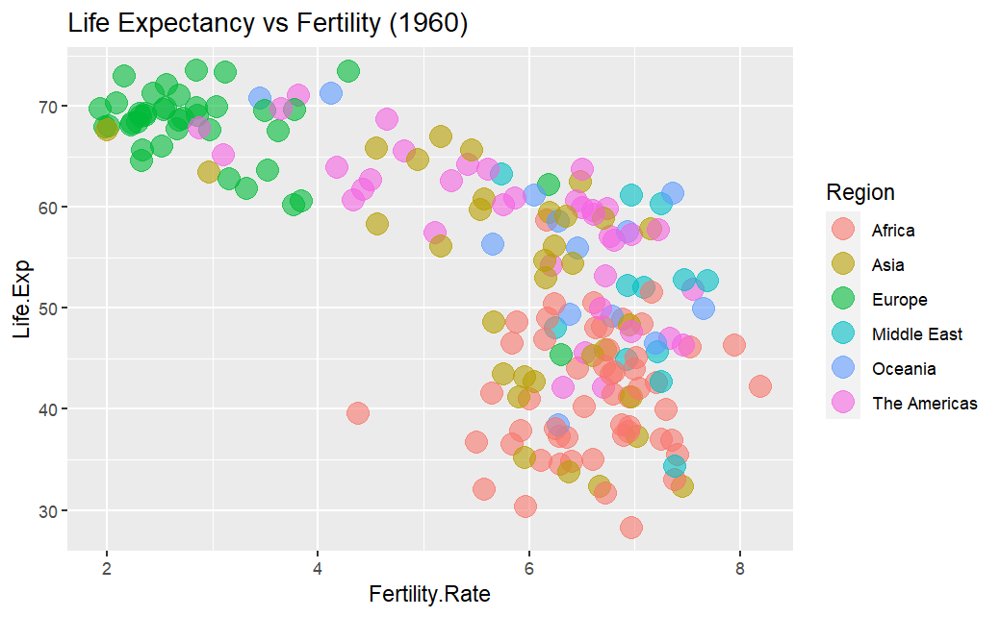
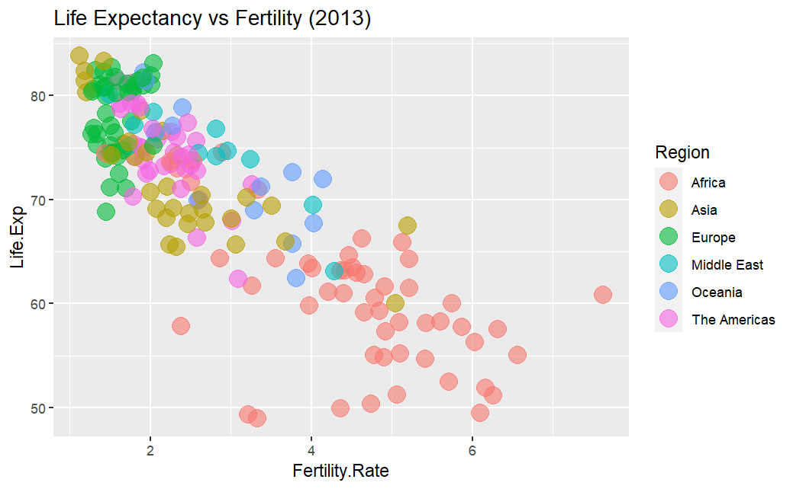

### [Measurement of Life Expectancy vs Fertility in 1960 & 2013]{.underline}

```{r}

# Read the CSV file
data <- read.csv('data/life-exp-fertility-data.csv') # 374 record +1 for labels

# Filter data for the year 1960
data_1960 <- subset(data, Year == 1960) # 187 record for 1960

# Filter data for the year 2013
data_2013 <- subset(data, Year == 2013) # 187 record for 2013

# Assign values to the vectors
Country_Code <- data_1960$Country.Code # select the country code 
Life_Expectancy_At_Birth_1960 <- data_1960$Life.Expectancy # records for 1960
Life_Expectancy_At_Birth_2013 <- data_2013$Life.Expectancy # records for 2013

# Display the first few values of each vector
print(Country_Code)
print(Life_Expectancy_At_Birth_1960)
print(Life_Expectancy_At_Birth_2013)

# Explore the data
head(data) # Check the first 6 rows of the data frame
tail(data) # Check the last 6 rows of the data frame
str(data) # Check the structure of the data frame
summary(data) # Check the summary of the data
data$Year # Access the 'Year' column of the data frame
temp <- factor(data$Year) # Convert 'Year' column to a factor
temp # Display the levels of the factor variable 'Year'


# Filter the dataframes
data1960 <- data[data$Year==1960,]
data2013 <- data[data$Year==2013,]

# Check row counts
nrow(data1960) #187 rows
nrow(data2013) #187 rows. Equal split.

# Create the additional dataframes
add1960 <- data.frame(Code=Country_Code, Life.Exp=Life_Expectancy_At_Birth_1960)
add2013 <- data.frame(Code=Country_Code, Life.Exp=Life_Expectancy_At_Birth_2013)

# Check summaries
summary(add1960)
summary(add2013)

# Merge the pairs of dataframes  
merged1960 <- merge(data1960, add1960, by.x="Country.Code", by.y="Code")
merged2013 <- merge(data2013, add2013, by.x="Country.Code", by.y="Code")

# Check the new structures
str(merged1960)
str(merged2013)

# We can see an obsolete column in each of the merged dataframes
# Column "Year" is no longer required. Let's remove it
merged1960$Year <- NULL
merged2013$Year <- NULL

# Check structures again
str(merged1960)
str(merged2013)

# Assuming you are using the dplyr package for data manipulation
library(dplyr)

# Check structures using pipe operator
merged1960 %>%
  str()

merged2013 %>%
  str()

# Visualization time
library(ggplot2)

# Visualize the 1960 dataset
qplot(data=merged1960, x=Fertility.Rate, y=Life.Exp,
      colour=Region, # colour
      size=I(5), # Set the size of the points to a fixed value of 5 units
      alpha=I(0.6), # transparency
      main="Life Expectancy vs Fertility (1960)" #title
)

# Visualize the 2013 dataset
qplot(data=merged2013, x=Fertility.Rate, y=Life.Exp,
      colour=Region, # colour
      size=I(5), # Set the size of the points to a fixed value of 5 units
      alpha=I(0.6), # transparency
      main="Life Expectancy vs Fertility (2013)" #title
)
```

/

**Observations by region:**

-   **Africa:** Despite having the lowest life expectancy, Africa also has the highest fertility rate. This could be due to several factors, such as high child mortality rates, cultural values around large families, and limited access to family planning resources.
-   **Asia:** Asia has a wide range of life expectancy and fertility rates, with Japan having the highest life expectancy (over 70 years) and Afghanistan having the lowest (under 40 years). Fertility rates also vary widely, with Mongolia having the highest (over 8 children per woman) and Singapore having the lowest (under 2 children per woman).
-   **Europe:** Europe has the highest overall life expectancy (over 65 years) and moderate fertility rates (around 3 children per woman).
-   **Middle East:** The Middle East has a moderate life expectancy (around 50 years) and high fertility rates (around 5 children per woman).
-   **Oceania:** Oceania has a high life expectancy (over 65 years) and moderate fertility rates (around 3 children per woman).
-   **The Americas:** The Americas have a wide range of life expectancy and fertility rates, with Canada having the highest life expectancy (over 70 years) and Haiti having the lowest (under 50 years). Fertility rates also vary widely, with Mexico having the highest (over 6 children per woman) and the United States having the lowest (around 2 children per woman).

**Conclusion:**

*Based on the provided observations by region, **Europe** and **Oceania** emerge as potentially favorable regions to live in the future. These regions exhibit a combination of **high life expectancy** and **moderate fertility rates**, suggesting a balance between longevity and population growth. In contrast, **Africa's low life expectancy** coupled with **high fertility rates** highlights challenges in **healthcare access** and **family planning**, which may impact future living conditions. While the **Americas** also offer a range of life expectancy and fertility rates, factors such as **economic stability** and **healthcare infrastructure** may influence long-term prospects. Ultimately, regions with **higher life expectancy** and **moderate fertility rates** may offer better prospects for quality of life and sustainable population growth in the future.*



**Observations by region:**

-   **Africa:** While still the region with the lowest life expectancy (around 55 years), Africa has seen a significant increase since 1960. Fertility rates have also decreased but remain the highest globally (around 4.5 children per woman).

-   **Asia:** Similar to 1960, Asia has a wide range of life expectancy and fertility rates. However, both measures have generally increased. Japan still has the highest life expectancy (over 80 years), while Afghanistan still has the lowest (around 50 years). Fertility rates vary, with Timor-Leste having the highest (over 5 children per woman) and Singapore still having the lowest (under 2 children per woman).

-   **Europe:** Europe maintains its high life expectancy (over 75 years) and moderate fertility rates (around 1.5 children per woman).

-   **Middle East:** The Middle East has seen an increase in life expectancy (around 65 years) and a decrease in fertility rates (around 3 children per woman).

-   **Oceania:** Oceania's life expectancy remains high (over 80 years) and fertility rates moderate (around 2 children per woman).

-   **The Americas:** The Americas continue to have a wide range of life expectancy and fertility rates. However, both measures have generally increased. Canada still has the highest life expectancy (over 80 years), while Haiti still has the lowest (around 60 years). Fertility rates also vary, with Guatemala having the highest (over 3 children per woman) and the United States and Canada having the lowest (around 2 children per woman).

**Conclusion:**

*Based on the observations by region, **Europe and Oceania** stand out as potentially optimal regions for future habitation. These regions demonstrate a harmonious blend of **high life expectancy** and **moderate fertility rates**, indicating a balance between longevity and sustainable population growth. Conversely, **Africa's persistently low life expectancy**, coupled with **high fertility rates**, underscores challenges in **healthcare accessibility** and **family planning**, which could adversely affect future living conditions. While the **Americas** present varying life expectancy and fertility rates, considerations such as **economic stability** and **healthcare infrastructure** may shape their long-term viability. Ultimately, regions characterized by **higher life expectancy** and **moderate fertility rates** may offer superior prospects for enhanced quality of life and sustainable population growth in the future.*
